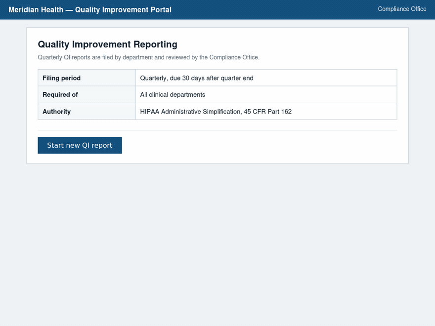
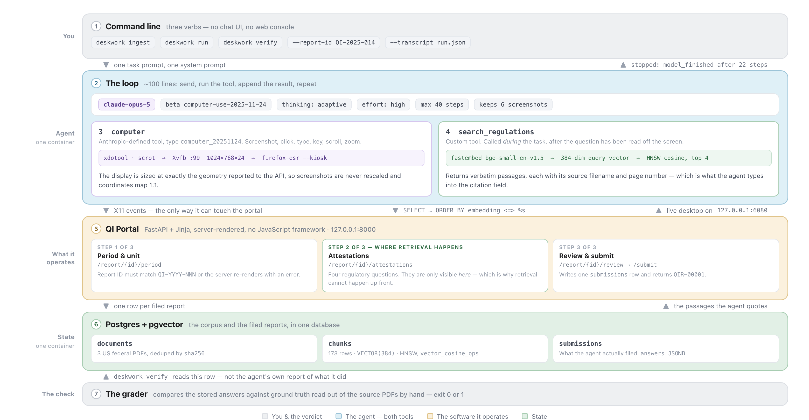

# deskwork

Supercharge Claude's computer use with retrieval.

[](https://github.com/ashnkumar/deskwork/actions/workflows/ci.yml)
[](https://www.python.org/downloads/)
[](LICENSE)



A real run, sped up. Three screens into a form it has never seen, the agent hits four regulatory
questions, searches a corpus of federal PDFs, and types back what it found with the filename and
page number.

## Quickstart

```bash
git clone https://github.com/ashnkumar/deskwork && cd deskwork
cp .env.example .env          # then put your key in ANTHROPIC_API_KEY

docker compose up -d --build

docker compose exec agent deskwork ingest
docker compose exec agent deskwork run
docker compose exec agent deskwork verify   # did it file a correct report?
```

An Anthropic API key is the only credential. Chunks are embedded on CPU with
`BAAI/bge-small-en-v1.5` into Postgres with pgvector — a local index, so there is no second key
and nothing to sign up for, and the model ships inside the image.

While `run` is going, open **<http://localhost:6080/vnc.html>** to watch, or
<http://localhost:8000> to fill the form in yourself.

## The pattern

Computer use lets an agent operate software nobody gave it an API to. That moves where its
information needs come from: it finds out what it has to know by *using* the software, several
steps in, off a screen you did not write and could not have predicted.

Retrieval that runs before the loop cannot help. Embedding the question and pasting the top
passages into the prompt assumes you hold the question when the run starts; here it is behind a
Continue button. So retrieval goes in the `tools` array next to `computer`, and the model reaches
for it when the screen gives it a reason to. There is no router.

The stakes come from what computer use *does*. A chat model that invents a regulation number says
a wrong thing to someone who can push back. A computer-use agent types it into a system of record
where it stays until an audit.

## What comes out

A task prompt goes in. A row in `submissions` comes out: four regulatory facts the agent looked
up rather than recalled, each with the document and page it came from.

| | Retrieval on its own | Computer use on its own | Both, as tools |
|---|---|---|---|
| **The answer** | Correct, and sitting in a chat window | Typed into the right field, and sometimes invented | Retrieved, then typed into the right field |
| **Into the system of record** | You do it | It does it | It does it |
| **Provenance** | You can cite it if you scroll up | None — the model cannot tell you where a remembered fact came from | Filename and page, in the form, because that is what the tool returned |
| **Knowing it worked** | You read it | The agent says it worked | `deskwork verify` reads the row back and grades it |

This corpus is small enough to paste whole — all three PDFs extract to 58,000 characters. What
that would not give you is the page number, and the page number is what gets typed into the form.

## The trace


`computer` drives the mouse and keyboard; `search_regulations` returns passages with their
filename and page number. Both go out in the same request.

A run is 22 or 23 steps and about two minutes. **The questions are on page two of the form.**
The agent reaches them at step 9, and at step 10 it says:

> Four regulatory questions. Let me look each up in the corpus rather than relying on memory.

then passes that question to `search_regulations` almost verbatim. There is no earlier point at
which that query could have been written.

Two things there are the model's: the **query text**, lifted off a screen we could not predict,
and the **number of searches** — four questions, two calls, unbatched. **The policy is ours.**
`prompts.py` tells it to search — *"You may well believe you already know the answer. Search
anyway"* — so this is a model given a rule about where facts may come from, in a situation where
only it can supply the query.

**The demo questions were written from the corpus**, so every one is answerable — which fixes
what is findable, not *when* the agent learns what it is asked. Claude almost certainly has
CMS-0055-F in training and could have answered from memory. It searched.

## Architecture



| # | Component | Module | What it does |
|---|---|---|---|
| **1** | Command line | `__main__.py` | `ingest`, `run`, `verify` |
| **2** | The loop | `agent.py` | Send, run the tool, append the result, repeat. Swaps old screenshots for a text note so a long run does not exhaust the context |
| **3** | Computer tool | `tools/computer.py` | `computer_20251124` against Xvfb via `xdotool` and `scrot` |
| **4** | Retrieval tool | `tools/search.py` | One embedding call, one SQL query, passages with provenance |
| **5** | The portal | `portal/app.py` | Three-step form with server-side validation. The target |
| **6** | Store | `db.py`, `ingest.py` | Postgres + pgvector. HNSW over 384-dim vectors |
| **7** | The grader | `verify` in `__main__.py` | Reads the `submissions` row and grades it against the PDFs |

The request is `client.beta.messages.create` with `betas=["computer-use-2025-11-24"]`, model
`claude-opus-5`, adaptive thinking, and both tools in one array.

The API can do the screenshot pruning for you:
[context editing](https://platform.claude.com/docs/en/build-with-claude/context-editing)
(`clear_tool_uses_20250919`, behind the `context-management-2025-06-27` beta) clears old tool
results server-side, as one request parameter. This repo keeps ~30 lines of its own so the
pruning is visible in the code, but if you are building rather than reading, use it.

## Applying this elsewhere

Four pieces transfer.

**Two tools in one request.** `computer` is Anthropic's, declared by type. `search_regulations`
is an ordinary custom tool — a JSON schema and a Python function. Same array, and the model
arbitrates; `agent.py` has no routing logic in it.

**A system prompt that separates knowing from looking up.** Two rules carry `prompts.py`:
**Never state a regulatory fact from memory**, and **never assume what is on screen**. The first
stops the model typing a plausible rule identifier out of training data; the second stops it
typing into a page that moved two steps ago.

**Neither rule is enforced.** Nothing in the loop inspects a typed string to check it came from a
retrieved passage. So the third piece is **a check that does not ask the agent**: `deskwork
verify` reads the filed row and grades it against the source documents.
Fabrication is not prevented here, only caught afterward.

**Display geometry that matches what you declare.** The X display is sized to exactly the
resolution reported to the API, so coordinates map 1:1 and a screenshot whose dimensions disagree
is a hard error rather than a drifting misclick. Rescaling is a permanent source of
off-by-a-scale-factor bugs.

To point this somewhere else: replace the PDFs in `corpus/`, re-run `ingest`, aim the agent at
your own software, and rewrite the task prompt. Only the grader has no generic version — it is
written against this form's four questions. `SPEC.md` has the data model, the chunking
measurements, and what was rejected on the way.

## Commands

| Command | What it does |
|---|---|
| `deskwork ingest` | Chunk and embed the corpus. Re-running replaces a document cleanly |
| `deskwork run` | One task, start to finish. `--report-id`, `--quarter`, `--department` |
| `deskwork run --transcript run.json` | The same, plus every message and tool call written out |
| `deskwork verify --report-id QI-2025-014` | Grade one filed report. Exit 0 or 1 |

Every setting is an environment variable, listed with defaults in `.env.example`. Worth changing:
`DESKWORK_MODEL` (`claude-opus-5`), `DESKWORK_EFFORT` (`high`), `DESKWORK_MAX_STEPS` (`40`) and
`DESKWORK_MAX_IMAGES` (`6` — screenshots dominate the token bill).

## Tests

```bash
uv run pytest           # 141 tests, no API key, no network
uv run pytest -m live   # the tier that spends money
```

- The **computer tool** is asserted against a recording runner — the exact `xdotool`
  invocations — then driven against a real Xvfb, typing into an `xterm` and reading it back.
- The **loop** runs against a fake client replaying recorded turns, where the subtle bugs live: a
  dropped `tool_result`, an unfaithful assistant echo, a pruned thinking block.
- **Retrieval quality is a test.** `test_chunk_size_is_tuned` pins the chunk size, because 1100
  characters answered three of five questions and 500 answers five.

Tests needing a display skip without one, so that count is what gets collected, not what passes.

## Limitations

- **Eleven out of eleven is a small sample.** Every graded run so far filed a correct report in
  22 or 23 steps, but eleven trials cannot distinguish a reliable agent from a lucky one — the
  true rate could be as low as **76%** and this measurement would not know.
- **The portal ships with this repo, and so do its questions** — see [The trace](#the-trace). A
  real form would ask things the corpus does not cover, and the failure mode there is a confident
  wrong answer.
- **The corpus is three documents** — enough to make retrieval meaningful, not enough to say
  anything about retrieval at scale. It is also trusted input, so pointing this at a corpus you
  do not control is an undefended prompt-injection boundary.

Also: the portal has no authentication, ownership, or CSRF protection, and `x11vnc` runs with
`-nopw` — which is why compose binds both it and the noVNC desktop to `127.0.0.1`. Computer use
is a beta API and it misclicks, which is part of why the step budget and the grader exist. Not
medical or legal advice.

## Corpus

Three US federal publications on HIPAA Administrative Simplification — public domain, checked for
patient-identifiable content. Provenance and retrieval dates are in
[`corpus/SOURCES.md`](corpus/SOURCES.md).

## License

MIT — see [LICENSE](LICENSE).
